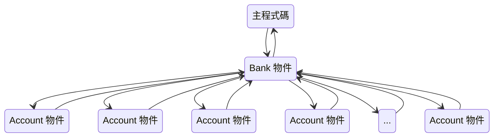

# OOP Note

物件導向程式設計介紹

## 1. 初見類別

- **類別（class）**：定義物件會記下的內容（它的資料或狀態）以及能夠做的事情（它的功能或行為）的程式碼。
- **物件（object）**：隨著時間的推移，資料和作用於該資料的程式碼。

- **實例化（instantiation）**：從類別建立物件的處理過程。

- **方法（method）**：定義在類別的函式。方法通常至少有一個參數，其名稱通常為 `self`。
- **實例變數（instance variable）**：在方法中，其名稱按照慣例是以 `self.` 當作前置開頭的所有變數。

Example:
```python
class <ClassName>():
    
    def __init__(self, <optional param1>, ..., <optional paramN>):
        # 實例化的程式碼放這
        
	# 存放資料的函式
    # 函式的形式：
    
    def <functionName!>(self, <optional param1>, ..., <optional paramN>):
        # 函式本體
    
    # ... 更多函式
    
```

## 2. 建立物件管理器物件

- **物件管理器物件（object manager object）**：這個物件通常是維護託管物件（通常是單個類別）的串列或字典並呼叫這些物件的方法。
- **組合（composition）**：這是一個由一個物件管理著一個或多個其他物件的邏輯結構。



1. 建立單個 Bank 物件並與之溝通的主程式碼。
2. 管理 Account 物件字典並呼叫這些物件方法的 Bank 物件。
3. Account 物件本身。

## 3. 更好的錯誤例外處理

### try 和 except：

Example:

```python
try:
    # 可能引發錯誤的一些程式碼（引發例外）
except <some exception name>: # 如果發生意外
    # 處理例外的一些程式碼
```

### raise 陳述句和自訂例外：

如果程式碼檢測到執行時期錯誤情況，則可以使用 `raise` 陳述句來發出例外信號。

Example:

```python
raise <ExceptionName>('<Any string to describe the error>')
```

上面的 `<ExceptionName>` ，可以有三個選擇可用。第一個，如果是存在與您檢測到的錯誤相符的標準例外：

|    異常物件名稱     |            說明            |
| :-----------------: | :------------------------: |
|  `AttributeError`   |  通常是指物件沒有這個屬性  |
| `FileNotFoundError` | 找不到 `open()` 開啟的檔案 |
|      `IOError`      |   在輸入或輸出時發生錯誤   |
|    `IndexError`     |      索引超出範圍區間      |
|     `KeyError`      |     在映射中沒有這個鍵     |
|    `MemoryError`    |   需求記憶體空間超出範圍   |
|     `NameError`     |       物件名稱未宣告       |
|    `SyntaxError`    |          語法錯誤          |
|    `SystemError`    |      直譯器的系統錯誤      |
|     `TypeError`     |        資料型別錯誤        |
|    `ValueError`     |        傳入無效參數        |
| `ZeroDivisionError` |          除數為 0          |

第二選擇是，可以使用通用的 `Exception` 例外來處理：

```python
raise Exception('The amount cannot be a floating-point number')
```

第三個選擇，也是最好的選擇，建立屬於自己的自訂例外。

Example:

```python
class <CustomExceptionName>(Exception):
    pass
```

## 4. 介面與實作

- **介面（interface）**：這是類別提供之方法的集合（以下每個方法期望的參數）。介面顯示了從該類別建立的物件能處理什麼操作。
- **實作（implementation）**：類別的實際程式碼內容，它展示了物件是如何運作的細節。